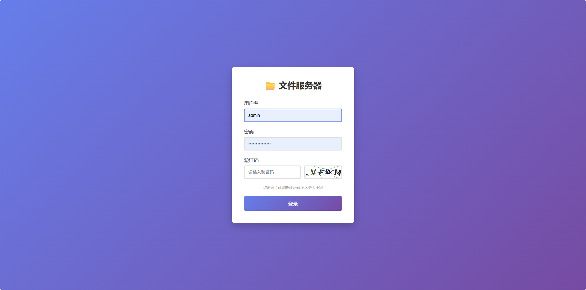
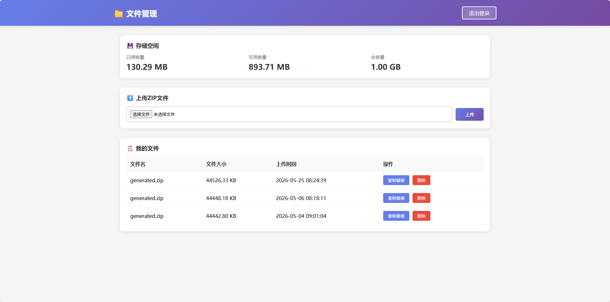

# 文件服务器使用说明

## 项目简介
这是一个轻量级的ZIP文件管理服务器，支持文件上传、下载、删除和容量管理功能。



## 主要功能
1. ✅ ZIP文件上传和下载
2. ✅ 一键复制下载链接
3. ✅ 文件删除功能
4. ✅ 容量限制和显示
5. ✅ 用户登录认证
6. ✅ 文件归属管理

## 使用前准备

### 1. 创建数据库
在MySQL中创建数据库：
```sql
CREATE DATABASE fileservice CHARACTER SET utf8mb4 COLLATE utf8mb4_unicode_ci;
```

### 2. 配置数据库连接
编辑 `src/main/resources/application.properties` 文件，修改以下配置：
```properties
spring.datasource.url=jdbc:mysql://localhost:3306/fileservice?useSSL=false&serverTimezone=UTC&allowPublicKeyRetrieval=true
spring.datasource.username=你的数据库用户名
spring.datasource.password=你的数据库密码
```

### 3. 配置文件存储路径和URL前缀
```properties
# 文件存储目录（相对或绝对路径）
file.upload-dir=./uploads

# 最大存储容量（字节），默认1GB
file.max-storage-size=1073741824

# 下载URL前缀，根据实际部署情况修改
file.download-url-prefix=http://localhost:8080/download/
```

## 运行项目

### 方式一：使用Maven
```bash
mvn spring-boot:run
```

### 方式二：打包后运行
```bash
mvn clean package
mvn clean package -DskipTests
java -jar target/fileService-0.0.1-SNAPSHOT.jar
```

## 访问系统

1. 启动后访问：http://localhost:8067/login
2. 默认管理员账号：
   - 用户名：admin
   - 密码：admin123

## 功能说明

### 登录
- 首次启动会自动创建admin账户
- 只有登录用户才能管理文件

### 上传文件
- 只支持ZIP格式文件
- 上传前会检查容量限制
- 超出容量会提示错误

### 文件管理
- 查看已上传的文件列表
- 显示文件大小和上传时间
- 一键复制下载链接
- 删除不需要的文件

### 存储空间
- 显示已用容量
- 显示可用容量
- 显示总容量

### 下载文件
- 无需登录即可下载
- 通过复制的链接直接下载

## 技术栈
- Spring Boot 4.0.5
- Spring Security（用户认证）
- Spring Data JPA（数据访问）
- MySQL（数据库）
- Liquibase（数据库版本管理）
- Thymeleaf（前端模板）

## 注意事项
1. 确保MySQL数据库已启动并可访问
2. 首次启动会自动执行Liquibase脚本创建表结构
3. 上传的文件存储在配置的upload-dir目录下
4. 建议在生产环境中修改默认密码
5. 定期备份数据库和上传的文件

##