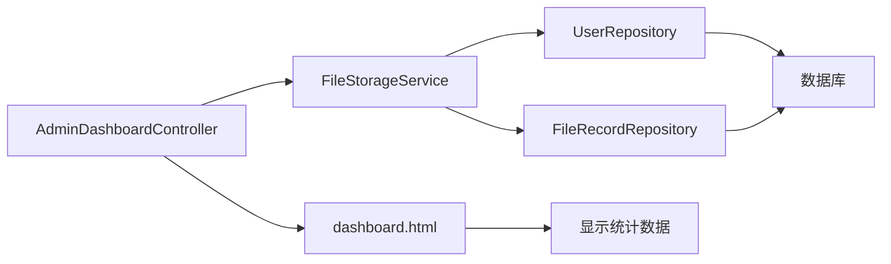

# 管理员控制台（Dashboard）开发报告

## 📋 任务概述

为管理员创建一个统一的主页/控制台，包含各种功能按钮的导航中心，方便快速访问系统的各项管理功能。

---

## ✅ 完成的工作

### 1. 创建管理员控制台页面

#### dashboard.html
**文件路径**: [dashboard.html](file://D:\ideaProject\fileService\src\main\resources\templates\admin\dashboard.html)

**主要特性**：

1. **统计卡片展示**
   - 👥 总用户数
   - 📁 总文件数
   - 💾 总存储使用
   - ⚙️ 系统状态

2. **核心功能区**
   - 👥 用户管理 - 查看、创建、删除用户
   - 📁 文件管理 - 查看所有用户上传的文件

3. **系统功能区**
   - 👤 个人信息 - 修改个人资料、密码
   - ⬆️ 文件上传 - 上传个人文件
   - ⚙️ 系统设置（开发中...）
   - 📊 日志管理（开发中...）

4. **响应式设计**
   - 支持桌面端和移动端
   - 自适应网格布局
   - 悬停动画效果

---

### 2. 创建控制器

#### AdminDashboardController.java
**文件路径**: [AdminDashboardController.java](file://D:\ideaProject\fileService\src\main\java\net\docn\fileservice\controller\AdminDashboardController.java)

**主要方法**：

```java
@GetMapping("/admin/dashboard")
public String dashboard(Model model, Authentication authentication) {
    // 获取当前用户名
    String username = authentication.getName();
    
    // 获取统计数据
    List<User> allUsers = fileStorageService.getAllUsers();
    List<FileRecord> allFiles = fileStorageService.getAllFiles();
    
    long totalUsers = allUsers.size();
    long totalFiles = allFiles.size();
    long totalStorage = allFiles.stream()
            .mapToLong(file -> file.getFileSize() != null ? file.getFileSize() : 0)
            .sum();
    
    // 传递给前端
    model.addAttribute("username", username);
    model.addAttribute("totalUsers", totalUsers);
    model.addAttribute("totalFiles", totalFiles);
    model.addAttribute("totalStorage", formatSize(totalStorage));
    
    return "admin/dashboard";
}
```

---

### 3. 扩展 FileStorageService

**文件路径**: [FileStorageService.java](file://D:\ideaProject\fileService\src\main\java\net\docn\fileservice\service\FileStorageService.java)

**新增方法**：

```java
/**
 * 获取所有文件（管理员）- 返回完整列表
 */
public List<FileRecord> getAllFiles() {
    return fileRecordRepository.findAllByOrderByUploadedAtDesc();
}
```

---

### 4. 更新现有页面导航

#### users.html
**修改位置**: 头部导航栏
**添加内容**: 
```html
<a href="/admin/dashboard" class="back-link">🎛️ 控制台</a>
```

#### files.html (管理员页面)
**修改位置**: 头部导航栏
**添加内容**: 
```html
<a href="/admin/dashboard" class="back-link">🎛️ 控制台</a>
```

#### files.html (普通用户页面)
**修改位置**: 头部导航栏
**添加内容**: 
```html
<a href="/admin/dashboard" class="profile-btn" th:if="${isAdmin}">🎛️ 控制台</a>
```

---

## 🎨 页面设计特点

### 1. 视觉设计

- **渐变背景**: 紫色渐变 (#667eea → #764ba2)
- **白色卡片**: 圆角阴影卡片，提升层次感
- **图标化**: 使用 Emoji 图标增强可读性
- **悬停效果**: 卡片悬停时向上移动并增加阴影

### 2. 布局结构

```
┌─────────────────────────────────────┐
│        管理员控制台标题               │
├─────────────────────────────────────┤
│  欢迎信息 + 返回按钮                 │
├─────────────────────────────────────┤
│  [统计卡片] [统计卡片]              │
│  [统计卡片] [统计卡片]              │
├─────────────────────────────────────┤
│  核心功能                            │
│  [用户管理] [文件管理]              │
├─────────────────────────────────────┤
│  系统功能                            │
│  [个人信息] [文件上传]              │
│  [系统设置*] [日志管理*]            │
└─────────────────────────────────────┘
```

### 3. 响应式设计

- **桌面端**: 多列网格布局
- **平板端**: 双列布局
- **移动端**: 单列布局

---

## 🔗 导航结构

```
/admin/dashboard (控制台主页)
    ├── /admin/users (用户管理)
    ├── /admin/files (文件管理)
    ├── /account/profile (个人信息)
    └── /files (文件上传)
```

所有子页面都有返回控制台的链接，形成完整的导航闭环。

---

## 📊 数据流



---

## 🚀 使用方法

### 1. 访问控制台

```
http://localhost:8067/admin/dashboard
```

### 2. 权限要求

- 必须是 ADMIN 角色的用户
- 需要登录状态

### 3. 功能入口

从控制台可以一键跳转到：
- 用户管理页面
- 文件管理页面
- 个人信息页面
- 文件上传页面

---

## 🎯 技术实现

### 后端技术

- **Spring Boot**: Web 框架
- **Thymeleaf**: 模板引擎
- **Spring Security**: 权限控制
- **JPA/Hibernate**: 数据访问

### 前端技术

- **HTML5**: 页面结构
- **CSS3**: 样式和动画
- **Flexbox/Grid**: 响应式布局
- **Emoji**: 图标系统

---

## 💡 未来扩展

### 计划添加的功能

1. **系统监控**
   - CPU 使用率
   - 内存使用情况
   - 磁盘空间监控

2. **操作日志**
   - 用户登录记录
   - 文件操作历史
   - 系统事件日志

3. **快捷操作**
   - 快速创建用户
   - 批量文件操作
   - 系统备份/恢复

4. **通知中心**
   - 系统公告
   - 异常提醒
   - 任务进度

---

## 📝 注意事项

1. **权限控制**: 确保只有 ADMIN 角色可以访问 `/admin/**` 路径
2. **性能优化**: 如果数据量很大，考虑使用缓存或异步加载统计数据
3. **安全性**: 所有敏感操作都需要 CSRF token 保护
4. **用户体验**: 保持页面简洁，避免功能过载

---

## ✅ 测试清单

### 功能测试

- [ ] 管理员可以正常访问控制台
- [ ] 统计数据正确显示
- [ ] 所有功能按钮可以正常跳转
- [ ] 非管理员无法访问控制台（403 错误）

### UI 测试

- [ ] 页面在不同浏览器正常显示
- [ ] 响应式设计在移动端正常工作
- [ ] 悬停动画流畅
- [ ] 图标和文字对齐正确

---

## 🎉 总结

管理员控制台已成功创建，提供了：

1. ✅ 统一的导航中心
2. ✅ 实时统计数据展示
3. ✅ 美观的用户界面
4. ✅ 完整的导航闭环
5. ✅ 响应式设计支持

现在重启应用，访问 `http://localhost:8067/admin/dashboard` 即可看到全新的管理员控制台！🚀
