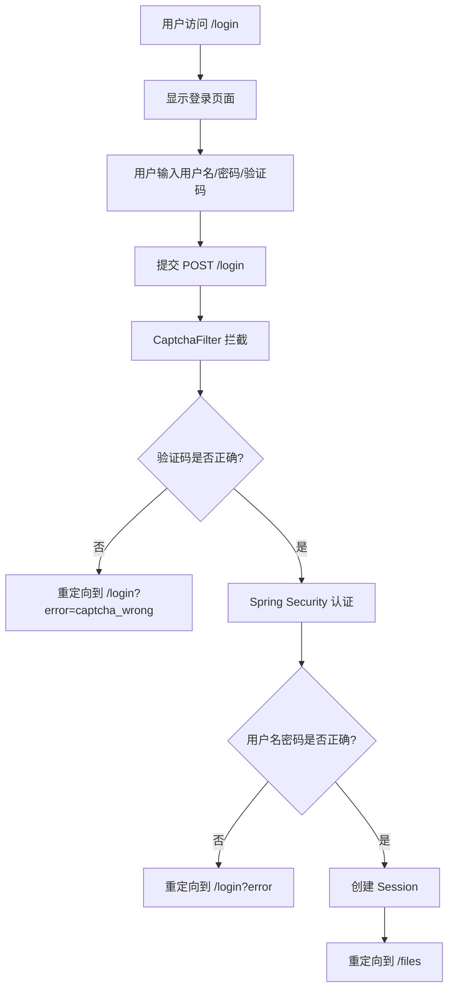
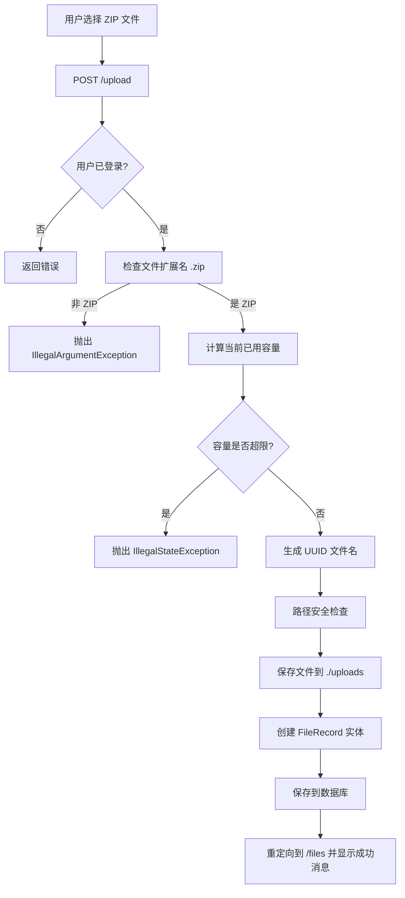

# FileService 文件服务器系统设计文档

## 1. 项目概述

### 1.1 项目简介
FileService 是一个基于 Spring Boot 的文件服务器系统，提供安全的文件上传、下载和管理功能。系统支持用户认证、验证码保护、容量限制等安全特性，专注于 ZIP 文件的存储和分发。

### 1.2 核心功能
- **用户认证**：基于 Spring Security 的用户登录/登出
- **验证码保护**：防止暴力破解的图形验证码机制
- **文件上传**：支持 ZIP 文件上传（最大 100MB）
- **文件下载**：公开的文件下载链接（无需登录）
- **文件管理**：查看、删除个人文件列表
- **容量控制**：用户存储空间限制（默认 1GB）

### 1.3 技术栈
| 类别 | 技术 | 版本 |
|------|------|------|
| 后端框架 | Spring Boot | 4.0.5 |
| Java 版本 | JDK | 21 |
| 安全框架 | Spring Security | - |
| 持久层 | Spring Data JPA | - |
| 数据库 | MySQL | - |
| 数据库迁移 | Liquibase | - |
| 模板引擎 | Thymeleaf | - |
| 构建工具 | Maven | - |

---

## 2. 系统架构

### 2.1 整体架构图
```
┌─────────────────────────────────────────────┐
│                  客户端 (Browser)             │
└──────────────┬──────────────────────────────┘
               │ HTTP/HTTPS
┌──────────────▼──────────────────────────────┐
│           Spring Security Filter Chain       │
│  ┌─────────────────────────────────────┐    │
│  │   CaptchaFilter (验证码验证)         │    │
│  └─────────────────────────────────────┘    │
│  ┌─────────────────────────────────────┐    │
│  │   UsernamePasswordAuthentication     │    │
│  └─────────────────────────────────────┘    │
└──────────────┬──────────────────────────────┘
               │
┌──────────────▼──────────────────────────────┐
│              Controller Layer                │
│  ┌──────────────┐    ┌──────────────────┐   │
│  │LoginController│    │ FileController   │   │
│  └──────────────┘    └──────────────────┘   │
│  ┌──────────────┐                            │
│  │CaptchaController│                         │
│  └──────────────┘                            │
└──────────────┬──────────────────────────────┘
               │
┌──────────────▼──────────────────────────────┐
│              Service Layer                   │
│  ┌──────────────┐    ┌──────────────────┐   │
│  │CaptchaService│    │FileStorageService│   │
│  └──────────────┘    └──────────────────┘   │
│  ┌──────────────────┐                       │
│  │CustomUserDetailsService│                 │
│  └──────────────────┘                       │
└──────────────┬──────────────────────────────┘
               │
┌──────────────▼──────────────────────────────┐
│          Repository Layer (JPA)              │
│  ┌──────────────┐    ┌──────────────────┐   │
│  │UserRepository│    │FileRecordRepository│  │
│  └──────────────┘    └──────────────────┘   │
└──────────────┬──────────────────────────────┘
               │
┌──────────────▼──────────────────────────────┐
│            Database (MySQL)                  │
│  ┌──────────────┐    ┌──────────────────┐   │
│  │   users      │    │  file_records    │   │
│  └──────────────┘    └──────────────────┘   │
└─────────────────────────────────────────────┘
               │
┌──────────────▼──────────────────────────────┐
│          File System (./uploads)             │
│         ZIP 文件物理存储                      │
└─────────────────────────────────────────────┘
```

### 2.2 分层架构说明

#### 2.2.1 表现层 (Presentation Layer)
- **Thymeleaf 模板**：`login.html`, `files.html`
- **静态资源**：CSS、JavaScript（如有）

#### 2.2.2 控制层 (Controller Layer)
- `FileController`：处理文件上传、下载、删除、列表展示
- `CaptchaController`：生成验证码图片
- 请求映射与参数校验

#### 2.2.3 业务层 (Service Layer)
- `FileStorageService`：文件存储逻辑、容量计算、安全检查
- `CaptchaService`：验证码生成算法
- `CustomUserDetailsService`：Spring Security 用户详情加载

#### 2.2.4 数据访问层 (Repository Layer)
- `UserRepository`：用户数据 CRUD
- `FileRecordRepository`：文件记录查询、容量统计

#### 2.2.5 配置层 (Configuration Layer)
- `SecurityConfig`：Spring Security 安全配置
- `FileStorageProperties`：文件存储配置属性
- `CaptchaFilter`：验证码验证过滤器
- `DataInitializer`：数据初始化
- `LiquibaseConfig`：数据库迁移配置

---

## 3. 数据库设计

### 3.1 ER 图
```
┌─────────────────┐         ┌──────────────────────┐
│     users       │         │    file_records      │
├─────────────────┤         ├──────────────────────┤
│ id (PK)         │◄────────│ user_id (FK)         │
│ username        │  1:N    │ id (PK)              │
│ password        │         │ filename             │
│ email           │         │ original_filename    │
│ created_at      │         │ file_size            │
│ updated_at      │         │ file_path            │
└─────────────────┘         │ content_type         │
                            │ uploaded_at          │
                            └──────────────────────┘
```

### 3.2 表结构详情

#### 3.2.1 用户表 (users)
| 字段名 | 类型 | 约束 | 说明 |
|--------|------|------|------|
| id | BIGINT | PK, AUTO_INCREMENT | 用户ID |
| username | VARCHAR(50) | NOT NULL, UNIQUE | 用户名 |
| password | VARCHAR(255) | NOT NULL | BCrypt加密密码 |
| email | VARCHAR(100) | NULLABLE | 邮箱地址 |
| created_at | TIMESTAMP | NOT NULL, DEFAULT CURRENT_TIMESTAMP | 创建时间 |
| updated_at | TIMESTAMP | NOT NULL, DEFAULT CURRENT_TIMESTAMP ON UPDATE | 更新时间 |

**索引**：
- PRIMARY KEY: `id`
- UNIQUE INDEX: `username`

#### 3.2.2 文件记录表 (file_records)
| 字段名 | 类型 | 约束 | 说明 |
|--------|------|------|------|
| id | BIGINT | PK, AUTO_INCREMENT | 记录ID |
| user_id | BIGINT | NOT NULL, FK → users(id) | 所属用户ID |
| filename | VARCHAR(255) | NOT NULL | 唯一文件名（UUID + 原文件名） |
| original_filename | VARCHAR(255) | NOT NULL | 原始文件名 |
| file_size | BIGINT | NOT NULL | 文件大小（字节） |
| file_path | VARCHAR(500) | NOT NULL | 物理文件路径 |
| content_type | VARCHAR(100) | NOT NULL | MIME类型 |
| uploaded_at | TIMESTAMP | NOT NULL, DEFAULT CURRENT_TIMESTAMP | 上传时间 |

**索引**：
- PRIMARY KEY: `id`
- FOREIGN KEY: `user_id` → `users(id)`
- INDEX: `idx_file_user_id` (user_id)

### 3.3 数据库迁移 (Liquibase)
- **主配置文件**：`db/changelog/db.changelog-master.xml`
- **变更集 001**：创建 `users` 和 `file_records` 表
- **变更集 002**：插入默认管理员账户（admin/admin123）

---

## 4. 核心业务流程

### 4.1 用户登录流程


**关键组件**：
1. **CaptchaFilter**：在 `UsernamePasswordAuthenticationFilter` 之前执行
2. **验证码验证**：从 Session 中获取 `captchaCode` 进行比对
3. **一次性使用**：验证成功后立即清除 Session 中的验证码

### 4.2 文件上传流程


**安全措施**：
1. **文件类型限制**：仅允许 `.zip` 文件
2. **容量限制**：检查用户总用量 + 新文件大小 ≤ 1GB
3. **路径遍历防护**：验证目标路径必须在 `rootLocation` 内
4. **唯一文件名**：使用 `UUID.randomUUID()` 避免冲突

### 4.3 文件下载流程
```mermaid
graph TB
    A[访问 /download/{filename}] --> B[路径安全检查]
    B --> C{路径是否合法?}
    C -->|否| D[抛出 RuntimeException]
    C -->|是| E{文件是否存在?}
    E -->|否| F[返回 404]
    E -->|是| G[创建 UrlResource]
    G --> H[设置 Content-Type: application/zip]
    H --> I[设置 Content-Disposition: attachment]
    I --> J[返回文件流]
```

**特点**：
- **无需登录**：下载接口公开访问
- **路径验证**：防止目录遍历攻击
- **ZIP 专用**：Content-Type 固定为 `application/zip`

### 4.4 文件删除流程
```mermaid
graph TB
    A[点击删除按钮] --> B[POST /delete/{id}]
    B --> C{用户已登录?}
    C -->|否| D[返回错误]
    C -->|是| E[查询 FileRecord]
    E --> F{记录存在?}
    F -->|否| G[抛出 RuntimeException]
    F -->|是| H{文件属于当前用户?}
    H -->|否| I[抛出无权访问异常]
    H -->|是| J[删除物理文件]
    J --> K[删除数据库记录]
    K --> L[重定向到 /files]
```

**权限控制**：
- 只能删除自己的文件
- 通过 `userId` 比对验证所有权

---

## 5. 安全设计

### 5.1 Spring Security 配置

#### 5.1.1 访问控制规则
```java
.requestMatchers("/login", "/captcha", "/css/**", "/js/**").permitAll()
.requestMatchers("/download/**").permitAll()
.anyRequest().authenticated()
```

**公开访问**：
- `/login`：登录页面
- `/captcha`：验证码生成
- `/download/**`：文件下载

**需要认证**：
- `/files`：文件管理页面
- `/upload`：文件上传
- `/delete/**`：文件删除

#### 5.1.2 CSRF 保护
- **启用状态**：已启用（默认）
- **Thymeleaf 集成**：表单自动添加 `_csrf` token
- **豁免接口**：无（所有 POST 请求都需要 CSRF token）

### 5.2 验证码机制

#### 5.2.1 生成算法
```java
// CaptchaService.java
CHARACTERS = "ABCDEFGHIJKLMNOPQRSTUVWXYZabcdefghijklmnopqrstuvwxyz0123456789"
CODE_LENGTH = 4
IMAGE_SIZE = 120x40
```

**特性**：
- 随机字符：大小写字母 + 数字
- 随机颜色：每个字符独立颜色
- 随机旋转：±0.2 弧度
- 干扰线：5 条随机线条
- 干扰点：30 个随机点

#### 5.2.2 验证流程
1. 生成时存储到 `HttpSession` (`captchaCode`)
2. 提交时在 `CaptchaFilter` 中比对
3. 验证后立即清除（防止重放攻击）
4. 不区分大小写（`equalsIgnoreCase`）

### 5.3 文件安全

#### 5.3.1 路径遍历防护
```java
// 上传时检查
if (!destinationFile.startsWith(rootLocation)) {
    throw new IOException("无法保存文件：无效的文件路径");
}

// 下载时检查
if (!filePath.startsWith(rootLocation)) {
    throw new RuntimeException("非法的文件访问");
}
```

#### 5.3.2 文件名混淆
- 使用 `UUID + 原文件名` 格式
- 示例：`3f16ddf1-b411-497d-86d2-e2ffd2164d03_generated.zip`
- 防止猜测其他用户文件

#### 5.3.3 容量限制
- **单用户上传上限**：1GB（可配置 `file.max-storage-size`）
- **实时计算**：每次上传前查询 `SUM(file_size)`
- **友好提示**：显示已用容量和可用容量

### 5.4 密码安全
- **加密算法**：BCrypt (`BCryptPasswordEncoder`)
- **默认用户**：admin / admin123（生产环境应修改）
- **盐值自动生成**：每用户独立盐值

### 5.5 错误信息隐藏
```properties
spring.web.error.include-message=never
spring.web.error.include-stacktrace=never
spring.web.error.include-exception=false
```

**目的**：防止泄露系统内部信息给攻击者

---

## 6. API 接口文档

### 6.1 认证相关

#### GET /login
- **描述**：登录页面
- **访问权限**：公开
- **响应**：Thymeleaf 模板 `login.html`

#### POST /login
- **描述**：提交登录凭证
- **访问权限**：公开
- **请求参数**：
  - `username` (String): 用户名
  - `password` (String): 密码
  - `captcha` (String): 验证码
  - `_csrf` (String): CSRF token
- **重定向**：
  - 成功：`/files`
  - 失败：`/login?error` 或 `/login?error=captcha_wrong`

#### GET /captcha
- **描述**：生成验证码图片
- **访问权限**：公开
- **响应类型**：`image/jpeg`
- **Session 副作用**：存储 `captchaCode` 和 `captchaTime`

#### POST /logout
- **描述**：退出登录
- **访问权限**：需要认证
- **重定向**：`/login?logout`

### 6.2 文件管理

#### GET /files
- **描述**：文件管理页面
- **访问权限**：需要认证
- **Model 属性**：
  - `files`: List<FileRecord> - 用户文件列表
  - `usedStorage`: String - 已用容量（格式化）
  - `availableStorage`: String - 可用容量（格式化）
  - `maxStorage`: String - 最大容量（格式化）
- **响应**：Thymeleaf 模板 `files.html`

#### POST /upload
- **描述**：上传 ZIP 文件
- **访问权限**：需要认证
- **请求参数**：
  - `file` (MultipartFile): ZIP 文件
  - `_csrf` (String): CSRF token
- **限制**：
  - 文件类型：仅 `.zip`
  - 文件大小：≤ 100MB（Servlet 配置）
  - 用户容量：≤ 1GB（应用配置）
- **重定向**：`/files`（带 Flash 消息）

#### POST /delete/{id}
- **描述**：删除文件
- **访问权限**：需要认证
- **路径参数**：
  - `id` (Long): 文件记录 ID
- **权限检查**：只能删除自己的文件
- **重定向**：`/files`（带 Flash 消息）

#### GET /download/{filename}
- **描述**：下载文件
- **访问权限**：公开
- **路径参数**：
  - `filename` (String): UUID 文件名
- **响应头**：
  - `Content-Type`: `application/zip`
  - `Content-Disposition`: `attachment; filename="..."`
- **响应体**：文件二进制流

---

## 7. 配置说明

### 7.1 应用配置 (application.properties)

#### 7.1.1 服务器配置
```properties
server.port=8067
```

#### 7.1.2 数据库配置
```properties
spring.datasource.url=jdbc:mysql://localhost:3306/fileservice?useSSL=false&serverTimezone=UTC&allowPublicKeyRetrieval=true
spring.datasource.username=root
spring.datasource.password=li336699
spring.datasource.driver-class-name=com.mysql.cj.jdbc.Driver
```

#### 7.1.3 JPA 配置
```properties
spring.jpa.hibernate.ddl-auto=none
spring.jpa.show-sql=true
spring.jpa.properties.hibernate.dialect=org.hibernate.dialect.MySQLDialect
```

**注意**：`ddl-auto=none` 表示由 Liquibase 管理 schema

#### 7.1.4 Liquibase 配置
```properties
spring.liquibase.enabled=true
spring.liquibase.change-log=classpath:db/changelog/db.changelog-master.xml
spring.liquibase.drop-first=false
```

#### 7.1.5 文件存储配置
```properties
file.upload-dir=./uploads
file.max-storage-size=1073741824  # 1GB (字节)
file.download-url-prefix=http://localhost:8067/download/
```

#### 7.1.6 文件上传限制
```properties
spring.servlet.multipart.max-file-size=100MB
spring.servlet.multipart.max-request-size=100MB
```

#### 7.1.7 错误处理配置
```properties
spring.web.error.include-message=never
spring.web.error.include-stacktrace=never
spring.web.error.include-exception=false
```

#### 7.1.8 日志配置
```properties
logging.level.liquibase=debug
```

### 7.2 配置类详解

#### FileStorageProperties
```java
@Component
@ConfigurationProperties(prefix = "file")
public class FileStorageProperties {
    private String uploadDir;        // 上传目录
    private long maxStorageSize;     // 最大存储容量（字节）
    private String downloadUrlPrefix; // 下载URL前缀
}
```

---

## 8. 前端页面设计

### 8.1 登录页面 (login.html)

#### 8.1.1 页面布局
- **标题**：📁 文件服务器
- **表单字段**：
  - 用户名（text）
  - 密码（password）
  - 验证码（text + 图片）
- **样式**：渐变紫色背景，白色卡片式表单

#### 8.1.2 验证码交互
- **刷新机制**：点击图片触发 `onclick="this.src='/captcha?' + Math.random()"`
- **提示文本**：不区分大小写
- **错误提示**：
  - `captcha_empty`：请输入验证码
  - `captcha_expired`：验证码已过期
  - `captcha_wrong`：验证码错误

### 8.2 文件管理页面 (files.html)

#### 8.2.1 功能模块
1. **容量展示**：已用容量 / 可用容量 / 总容量
2. **上传表单**：文件选择器 + 上传按钮
3. **文件列表**：表格展示
   - 原始文件名
   - 文件大小（格式化）
   - 上传时间
   - 操作按钮（下载、删除）
4. **消息提示**：成功/错误 Flash 消息

#### 8.2.2 安全特性
- **CSRF Token**：Thymeleaf 自动添加到表单
- **动态 URL**：使用 `th:action` 和 `th:href`

---

## 9. 部署与运维

### 9.1 环境要求
- **JDK**：21+
- **MySQL**：5.7+ 或 8.0+
- **Maven**：3.6+（仅开发环境）

### 9.2 部署步骤

#### 9.2.1 数据库准备
```sql
CREATE DATABASE fileservice CHARACTER SET utf8mb4 COLLATE utf8mb4_unicode_ci;
```

#### 9.2.2 编译打包
```bash
mvn clean package -DskipTests
```

#### 9.2.3 运行应用
```bash
java -jar target/fileService-0.0.1-SNAPSHOT.jar
```

#### 9.2.4 验证部署
- 访问：`http://localhost:8067/login`
- 默认账号：admin / admin123

### 9.3 目录结构
```
fileService/
├── uploads/              # 文件存储目录（运行时创建）
├── fileService.jar       # 应用JAR包
└── application.properties # 外部配置文件（可选）
```

### 9.4 监控与维护

#### 9.4.1 日志位置
- Spring Boot 默认输出到控制台
- 建议配置文件追加器用于生产环境

#### 9.4.2 数据库备份
```bash
mysqldump -u root -p fileservice > backup_$(date +%Y%m%d).sql
```

#### 9.4.3 文件备份
```bash
tar -czf uploads_backup_$(date +%Y%m%d).tar.gz uploads/
```

---

## 10. 开发规范

### 10.1 代码组织
```
src/main/java/net/docn/fileservice/
├── config/          # 配置类
├── controller/      # 控制器
├── entity/          # JPA 实体
├── repository/      # 数据访问层
├── service/         # 业务逻辑层
└── util/            # 工具类
```

### 10.2 命名规范
- **类名**：PascalCase（如 `FileStorageService`）
- **方法名**：camelCase（如 `uploadFile`）
- **常量**：UPPER_SNAKE_CASE（如 `MAX_STORAGE_SIZE`）
- **包名**：全小写（如 `net.docn.fileservice.config`）

### 10.3 事务管理
- **写操作方法**：必须添加 `@Transactional`
- **示例**：`uploadFile()`, `deleteFile()`
- **只读方法**：可不加（默认 readOnly=false）

### 10.4 异常处理
- **业务异常**：抛出 `IllegalArgumentException`, `IllegalStateException`
- **系统异常**：抛出 `RuntimeException` 或自定义异常
- **Controller 层**：捕获异常并转换为友好的 Flash 消息

### 10.5 日志规范
```java
private static final Logger log = LoggerFactory.getLogger(XxxController.class);

log.info("文件上传成功: {}", filename);      // 关键业务操作
log.warn("上传参数错误: {}", e.getMessage()); // 可恢复的错误
log.error("上传失败", e);                     // 系统异常（带堆栈）
```

---

## 11. 测试策略

### 11.1 单元测试
- **Service 层**：Mock Repository 测试业务逻辑
- **Controller 层**：使用 `@WebMvcTest` 测试请求映射

### 11.2 集成测试
- **完整流程**：使用 `@SpringBootTest` 测试端到端场景
- **数据库测试**：使用 H2 内存数据库或 Testcontainers

### 11.3 安全测试
- **验证码绕过**：尝试直接 POST /login 不带验证码
- **路径遍历**：尝试下载 `../../../etc/passwd`
- **越权访问**：尝试删除其他用户的文件
- **CSRF 攻击**：尝试不带 CSRF token 提交表单

---

## 12. 性能优化建议

### 12.1 数据库优化
- **索引**：已在 `file_records.user_id` 上创建索引
- **查询优化**：使用 `COALESCE(SUM(...), 0)` 避免 NULL 值

### 12.2 文件存储优化
- **大文件处理**：当前限制 100MB，适合中小文件
- **未来改进**：考虑分块上传、断点续传

### 12.3 缓存策略
- **验证码**：存储在 Session 中，无需额外缓存
- **文件列表**：可考虑添加 Redis 缓存（高频访问场景）

### 12.4 并发控制
- **当前实现**：依赖数据库事务隔离
- **高并发场景**：考虑乐观锁或分布式锁

---

## 13. 已知限制与改进方向

### 13.1 当前限制
1. **文件类型**：仅支持 ZIP 文件
2. **单用户模式**：虽然有用户表，但主要面向单用户使用
3. **存储后端**：仅支持本地文件系统
4. **无文件预览**：无法在线查看 ZIP 内容
5. **无分享功能**：下载链接无有效期和访问次数限制

### 13.2 改进方向

#### 短期改进
- [ ] 支持更多文件类型（PDF、DOCX、图片等）
- [ ] 添加文件搜索功能
- [ ] 实现批量删除
- [ ] 添加上传进度条

#### 中期改进
- [ ] 集成对象存储（MinIO、AWS S3）
- [ ] 实现文件分享链接（带有效期）
- [ ] 添加文件版本管理
- [ ] 支持文件夹层级结构

#### 长期改进
- [ ] 微服务化拆分
- [ ] 分布式文件存储
- [ ] CDN 加速下载
- [ ] 文件内容检索（全文搜索）

---

## 14. 常见问题 (FAQ)

### Q1: 如何修改默认管理员密码？
**A**: 启动后登录系统，或通过 SQL 更新：
```sql
UPDATE users SET password = '$2a$10$...' WHERE username = 'admin';
```
使用 `PasswordEncoderUtil` 生成新的 BCrypt 哈希值。

### Q2: 如何调整用户存储容量？
**A**: 修改 `application.properties`：
```properties
file.max-storage-size=2147483648  # 2GB
```

### Q3: 上传大文件失败怎么办？
**A**: 检查两个配置：
1. `spring.servlet.multipart.max-file-size`（Spring MVC 限制）
2. `file.max-storage-size`（业务逻辑限制）

### Q4: 如何备份用户上传的文件？
**A**: 定期备份 `uploads/` 目录和数据库：
```bash
tar -czf backup.tar.gz uploads/
mysqldump -u root -p fileservice > db_backup.sql
```

### Q5: 验证码一直提示错误？
**A**: 检查以下项：
1. Session 是否正常创建
2. 浏览器是否禁用 Cookie
3. 服务器时间是否同步
4. 查看日志中的验证码比对信息

---

## 15. 附录

### 15.1 依赖清单
```xml
<!-- 核心依赖 -->
spring-boot-starter-webmvc
spring-boot-starter-thymeleaf
spring-boot-starter-security
spring-boot-starter-data-jpa
mysql-connector-j
liquibase-core
```

### 15.2 端口占用
- **默认端口**：8067
- **修改方式**：`server.port=xxxx`

### 15.3 默认账户
- **用户名**：admin
- **密码**：admin123
- **⚠️ 警告**：生产环境必须修改！

### 15.4 参考资料
- [Spring Boot 官方文档](https://spring.io/projects/spring-boot)
- [Spring Security 指南](https://spring.io/projects/spring-security)
- [Liquibase 文档](https://docs.liquibase.com/)
- [Thymeleaf 教程](https://www.thymeleaf.org/)

---

## 文档版本历史

| 版本 | 日期 | 作者 | 说明 |
|------|------|------|------|
| 1.0 | 2026-06-11 | AI Assistant | 初始版本，基于项目代码分析生成 |

---

**文档结束**
